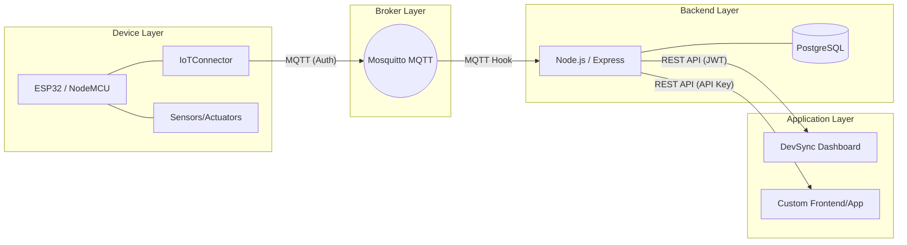

# DevSync IoT Platform

**DevSync** is a lightweight, reusable IoT platform that connects IoT devices, collects and stores telemetry, provides secure device control, and allows developers to build applications, dashboards, custom frontends, and external integrations through controlled APIs.

## What problem does this solve?
When developers create a new IoT device or application, they repeatedly have to implement boilerplate code for Wi-Fi, MQTT connection, authentication, telemetry, and reconnect logic. **DevSync eliminates this boilerplate.** 

By providing a reusable C++ IoT Connector and a complete, multi-tenant backend architecture (with dashboards and APIs), you can focus entirely on your specific hardware sensors and your custom frontend design.

---

## 🏗 Core Architecture



### Technology Stack
- **Backend:** Node.js (Express), Mosquitto MQTT Broker
- **Database:** PostgreSQL
- **Frontend:** React + Vite + TailwindCSS
- **Hardware:** ESP32/NodeMCU using C++ (Arduino Framework)

---

## 🚀 Quick Start Guide

### 1. Prerequisites
- Node.js v20+
- PostgreSQL 15+
- Mosquitto MQTT Broker

### 2. Environment Setup
Clone the repository and set up your backend environment variables:
```bash
cp backend/.env.example backend/.env
```
Edit `backend/.env` to include your PostgreSQL credentials and secure secrets.

### 3. Database Setup
Create the PostgreSQL database and run the migrations:
```bash
# In psql or your db manager:
# CREATE DATABASE iot_platform;

# Run migrations
cd backend
npm install
npm run migrate
```

### 4. Start the Backend & MQTT
Ensure Mosquitto is running locally on port `1883`. Then start the DevSync Node.js backend:
```bash
cd backend
npm run dev
```
*The backend will run on `http://localhost:3000`.*

### 5. Start the Frontend Dashboard
```bash
cd frontend
npm install
npm run dev
```
*The dashboard will run on `http://localhost:5173`.*

---

## 🛠 Using the Platform

### Step 1: Create a Workspace & Application
1. Open the DevSync Dashboard (`http://localhost:5173`).
2. Log in (or register your first admin account).
3. Create a **Workspace**.
4. Inside the Workspace, create an **Application**.

### Step 2: Register a Device
1. Navigate to **Devices** and click **Add Device**.
2. Note the generated **Device ID** and **Secret Key**. *(Keep the secret key safe!)*
3. Navigate back to your Application and **assign** the newly created device to the application.

### Step 3: Connect your Hardware (IoTConnector)
In your ESP32 project, include the `IoTConnector` library:
```cpp
#include "IoTConnector.h"

IoTConnector connector(
    "WIFI_SSID", "WIFI_PASS", 
    "192.168.1.X", 1883, // MQTT Broker IP
    "DEV-YOUR-ID",       // DevSync Device ID
    "YOUR-SECRET-KEY"    // DevSync Secret Key
);

void setup() {
    connector.begin();
}

void loop() {
    connector.loop();
    // Publish telemetry
    connector.publishTelemetry("temperature", 24.5);
}
```

### Step 4: View Telemetry & Build Dashboards
1. Navigate to your Application in the DevSync dashboard.
2. Go to **Dashboards -> Create Dashboard**.
3. Add a Line Chart or Gauge widget, select your device, and watch real-time data flow in!

---

## 📖 Developer Documentation

DevSync is designed to act as a headless backend for your own projects. For deeper integration, refer to our detailed documentation:

- [API & Custom Frontend Guide](docs/DEVELOPER_GUIDE.md): Learn how to use API Keys to pull data into your own mobile app or external frontend.
- [IoT Connector Guide](docs/IOT_CONNECTOR.md): Learn the exact MQTT flow, how to handle reconnects, and how to receive commands on your device.
- [Security Model](docs/SECURITY_MODEL.md): Understand the tenant isolation, JWT boundaries, and MQTT authentication rules.

---

## 📊 Final Project Status

**DevSync is COMPLETE.** (Finalized at Phase 6O).

The platform successfully implements multi-tenant isolation, dynamic API key generation, data retention policies, device command routing, and a lightweight React application dashboard.

*Testing Limits:* Load tested securely up to 100 simultaneous simulated device telemetry blasts (QoS 1) with 0 dropped messages, and 200 concurrent REST API loads with an average response time of ~11ms.

*Note: DevSync is designed as a mid-tier college-project scale platform and relies on a monolithic Node.js ingestion path. It is not intended for enterprise-scale Kubernetes/Kafka deployments.*
