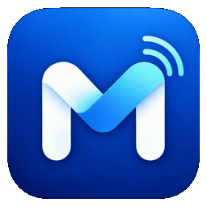
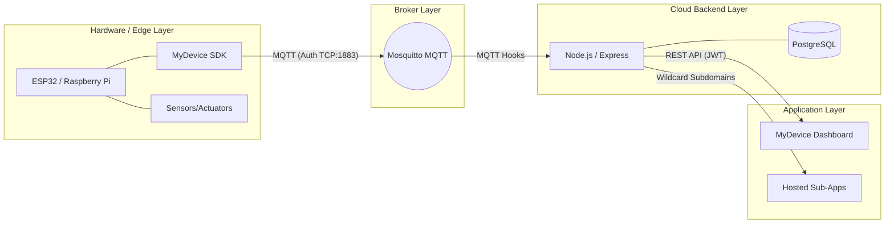

<div align="center">
  
  <h1>MyDevice IoT Platform</h1>
  <p><strong>A Lightweight, Reusable, and Scalable IoT Management Platform</strong></p>

  <!-- Badges -->
  <p>
    <a href="https://github.com/NajrudinAn/iot.Mydevice/blob/main/LICENSE"></a>
    
    
    
    
  </p>
</div>

---

## ⚡ What is MyDevice?

When developers create a new IoT device or application, they repeatedly have to implement boilerplate code for Wi-Fi, MQTT connection, authentication, telemetry syncing, and reconnect logic. **MyDevice eliminates this boilerplate.** 

By providing highly abstract SDKs (Python, Node.js, Arduino/C++) and a complete, multi-tenant backend architecture with dynamic dashboards and APIs, you can focus entirely on your specific hardware sensors and your custom application logic.

---

## 🏗 Core Architecture



### 💻 Technology Stack
- **Backend:** Node.js (Express), Mosquitto MQTT Broker (Native)
- **Database:** PostgreSQL
- **Frontend:** React + Vite + TailwindCSS
- **Hardware/SDK:** Python, Node.js, and C++ (Arduino Framework)

---

## 🚀 Quick Start Guide (Local Development)

*For production server setup, please refer to the [Production Deployment Guide](DEPLOYMENT.md).*

### 1. Prerequisites
- Node.js v18+
- PostgreSQL 14+
- Mosquitto MQTT Broker

### 2. Environment Setup
Clone the repository and set up your backend environment variables:
```bash
git clone git@github.com:NajrudinAn/iot.Mydevice.git
cd iot.Mydevice
cp backend/.env.example backend/.env
```
Edit `backend/.env` to include your PostgreSQL credentials and secure secrets.

### 3. Database Setup
Create the PostgreSQL database and run the migrations:
```bash
# In psql or your db manager:
# CREATE DATABASE mydevice;

# Run migrations
cd backend
npm install
npm run db:init
```

### 4. Start the Backend & MQTT
Ensure Mosquitto is running locally on port `1883`. Then start the MyDevice Node.js backend:
```bash
cd backend
npm run dev
```
*The backend will run on `http://localhost:3000`.*

### 5. Start the Frontend Dashboard
```bash
cd frontend
npm install
npm run dev
```
*The dashboard will run on `http://localhost:5173`.*

---

## 🛠 Using the Platform

### Step 1: Create a Workspace & Application
1. Open the MyDevice Dashboard (`http://localhost:5173`).
2. Log in (or register your first admin account).
3. Create a **Workspace**.
4. Inside the Workspace, create an **Application**.

### Step 2: Register a Device
1. Navigate to **Devices** and click **Add Device**.
2. Note the generated **Device ID** and **Secret Key**. *(Keep the secret key safe!)*
3. Navigate back to your Application and **assign** the newly created device to the application.

### Step 3: Connect your Hardware
Use the official **MyDevice SDK**. Here is an example of the incredibly simple Python SDK:

```python
from mydevice import MyDevice
import time

device = MyDevice("DEVICE_ID", "YOUR_SECRET_KEY")

# 1. Read-only Data (Telemetry, Status, etc.)
device.add_reading("temperature", "Temperature", data_type="number", unit="°C")

# 2. Controllable Switch (generates a UI toggle automatically)
def handle_light(is_on):
    print("💡 Turning light ON" if is_on else "💡 Turning light OFF")

device.add_switch("main_light", "Main Light", on_change=handle_light)

# Connect & loop
device.connect()
while True:
    device.send("temperature", 24.5)
    time.sleep(5)
```
*(Available in Python, Node.js, and Arduino!)*

### Step 4: View Telemetry & Build Dashboards
1. Navigate to your Application in the MyDevice dashboard.
2. Go to **Dashboards -> Create Dashboard**.
3. Add a Line Chart or Gauge widget, select your device, and watch real-time data flow in instantly!

---

## 📖 Comprehensive Documentation

MyDevice is designed to act as a headless backend for your own projects. For deeper integration, refer to our detailed documentation:

- 📚 **[SDK Reference Guide](docs/SDK_REFERENCE.md):** Complete guide to connecting your hardware via Python, Node.js, and Arduino.
- 🚀 **[Production Deployment Guide](DEPLOYMENT.md):** A step-by-step masterclass on deploying MyDevice to a fresh Ubuntu cloud server, including Nginx, Cloudflare, PM2, and native systemd Mosquitto.

---

## 📊 Project Status

**MyDevice is COMPLETE.** 

The platform successfully implements multi-tenant isolation, dynamic API key generation, data retention policies, device command routing, blueprint schema inference, and a beautiful React application dashboard.

*Testing Limits:* Load tested securely up to 100 simultaneous simulated device telemetry blasts (QoS 1) with 0 dropped messages, and 200 concurrent REST API loads with an average response time of ~11ms.

---

## 📜 License

This project is licensed under the MIT License - see the [LICENSE](LICENSE) file for details.
